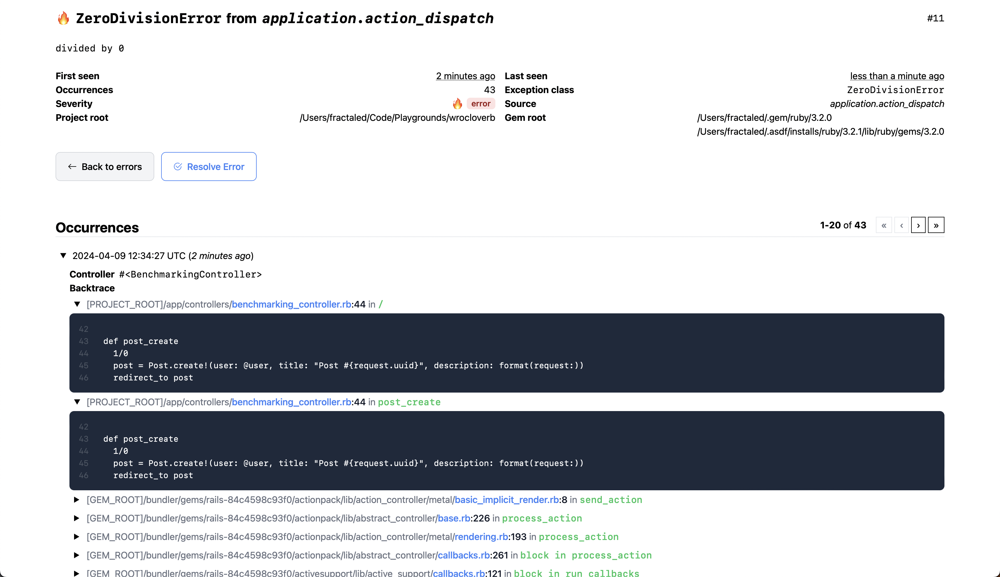

# Solid Errors

<p>
  <a href="https://rubygems.org/gems/solid_errors">
    
  </a>
  <a href="https://rubygems.org/gems/solid_errors">
    
  </a>
  <a href="https://github.com/testdouble/standard">
    
  </a>
  <a href="https://github.com/fractaledmind/solid_errors/actions/workflows/main.yml">
    
  </a>
  <a href="https://github.com/sponsors/fractaledmind">
    
  </a>
  <a href="https://ruby.social/@fractaledmind">
    
  </a>
  <a href="https://twitter.com/fractaledmind">
    
  </a>
</p>


Solid Errors is a DB-based, app-internal exception tracker for Rails applications, designed with simplicity and performance in mind. It uses the new [Rails error reporting API](https://guides.rubyonrails.org/error_reporting.html) to store uncaught exceptions in the database, and provides a simple UI for viewing and managing exceptions.

## Installation

Install the gem and add to the application's Gemfile by executing:

    $ bundle add solid_errors

If bundler is not being used to manage dependencies, install the gem by executing:

    $ gem install solid_errors

After installing the gem, run the installer:

    $ rails generate solid_errors:install

This will copy the required migration over to your app.

Then mount the engine in your config/routes.rb file

    mount SolidErrors::Engine, at: "/solid_errors"

> [!NOTE]
> Be sure to [secure the dashboard](#authentication) in production.

## Usage

All exceptions are recorded automatically. No additional code required.

Please consult the [official guides](https://guides.rubyonrails.org/error_reporting.html) for an introduction to the error reporting API.

### Configuration

You can configure Solid Errors via the Rails configuration object, under the `solid_errors` key. Currently, only 3 configuration options are available:

* `connects_to` - The database configuration to use for the Solid Errors database. See [Database Configuration](#database-configuration) for more information.
* `username` - The username to use for HTTP authentication. See [Authentication](#authentication) for more information.
* `password` - The password to use for HTTP authentication. See [Authentication](#authentication) for more information.

#### Database Configuration

`config.solid_errors.connects_to` takes a custom database configuration hash that will be used in the abstract `SolidErrors::Record` Active Record model. This is required to use a different database than the main app. For example:

```ruby
# Use a single separate DB for Solid Errors
config.solid_errors.connects_to = { database: { writing: :solid_errors, reading: :solid_errors } }
```

or

```ruby
# Use a separate primary/replica pair for Solid Errors
config.solid_errors.connects_to = { database: { writing: :solid_errors_primary, reading: :solid_errors_replica } }
```

#### Authentication

Solid Errors does not restrict access out of the box. You must secure the dashboard yourself. However, it does provide basic HTTP authentication that can be used with basic authentication or Devise. All you need to do is setup a username and password.

There are two ways to setup a username and password. First, you can use the `SOLIDERRORS_USERNAME` and `SOLIDERRORS_PASSWORD` environment variables:

```ruby
ENV["SOLIDERRORS_USERNAME"] = "frodo"
ENV["SOLIDERRORS_PASSWORD"] = "ikeptmysecrets"
```

Second, you can set the `SolidErrors.username` and `SolidErrors.password` variables in an initializer:

```ruby
# Set authentication credentials for Solid Errors
config.solid_errors.username = Rails.application.credentials.solid_errors.username
config.solid_errors.password = Rails.application.credentials.solid_errors.password
```

Either way, if you have set a username and password, Solid Errors will use basic HTTP authentication. If you have not set a username and password, Solid Errors will not require any authentication to view the dashboard.

If you use Devise for authenctication in your app, you can also restrict access to the dashboard by using their `authenticate` contraint in your routes file:

```ruby
authenticate :user, -> (user) { user.admin? } do
  mount SolidErrors::Engine, at: "/solid_errors"
end
```

### Examples

There are only two screens in the dashboard.

* the index view of all unresolved errors:


* and the show view of a particular error:



## Development

After checking out the repo, run `bin/setup` to install dependencies. Then, run `rake test` to run the tests. You can also run `bin/console` for an interactive prompt that will allow you to experiment.

To install this gem onto your local machine, run `bundle exec rake install`. To release a new version, update the version number in `version.rb`, and then run `bundle exec rake release`, which will create a git tag for the version, push git commits and the created tag, and push the `.gem` file to [rubygems.org](https://rubygems.org).

## Contributing

Bug reports and pull requests are welcome on GitHub at https://github.com/fractaledmind/solid_errors. This project is intended to be a safe, welcoming space for collaboration, and contributors are expected to adhere to the [code of conduct](https://github.com/fractaledmind/solid_errors/blob/main/CODE_OF_CONDUCT.md).

## License

The gem is available as open source under the terms of the [MIT License](https://opensource.org/licenses/MIT).

## Code of Conduct

Everyone interacting in the SolidErrors project's codebases, issue trackers, chat rooms and mailing lists is expected to follow the [code of conduct](https://github.com/fractaledmind/solid_errors/blob/main/CODE_OF_CONDUCT.md).
